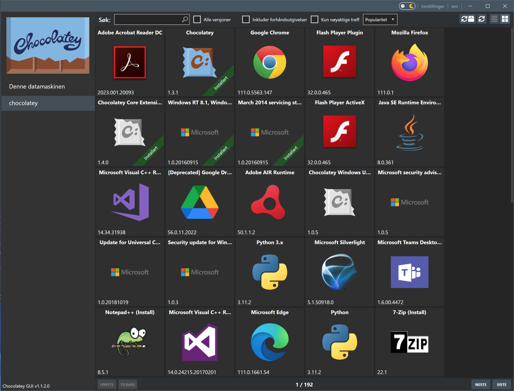

# Chocolatey

[🔗](https://chocolatey.org/)

Chocolatey is a machine-level package manager and installer for software packages, like Homebrew for macOS. It is an execution engine using the NuGet packaging infrastructure and Windows PowerShell to provide an automation tool for installing software on Windows machines, designed to simplify the process from the user perspective. The name is an extension on a pun of NuGet (from "nougat") "because everyone loves Chocolatey nougat".

## Install Chocolatey

[🔗](https://docs.chocolatey.org/en-us/choco/setup)

Open a PowerShell window as an **administrator** and run the following command, which checks if the PowerShell profile exists, if not it creates it. Then it installs Chocolatey and refreshes the environment variables.

```powershell
Set-Location $env:USERPROFILE
If ( ! ( Test-Path $PROFILE ) ) { New-Item -Force -ItemType File -Path $PROFILE; Add-Content -Path $PROFILE -Encoding UTF8 -Value "# Powershell Profile"; }
Set-ExecutionPolicy Bypass -Scope Process -Force; iex ((New-Object System.Net.WebClient).DownloadString('https://chocolatey.org/install.ps1'))
RefreshEnv.cmd
```

## PowerShell Auto-Completion

Chocolatey provides PowerShell auto-completion for the `choco` command. To enable it, run the following command in PowerShell:

```powershell
echo "
# Chocolatey
`$ChocolateyProfile = ""`$env:ChocolateyInstall\helpers\chocolateyProfile.psm1""
if (Test-Path(`$ChocolateyProfile)) {
    Import-Module ""`$ChocolateyProfile""
}
" | Out-File $PROFILE -Encoding UTF8 -Append
```

## Use Chocolatey

[🔗](https://docs.chocolatey.org/en-us/choco/commands/)

To list all installed packages, run the following command:

```powershell
choco list -lo
```

| Command                                                     | Description                            |
| ----------------------------------------------------------- | -------------------------------------- |
| [list](https://chocolatey.org/docs/commands-list)           | lists remote or local packages         |
| [search](https://chocolatey.org/docs/commands-search)       | searches remote or local packages      |
| [info](https://chocolatey.org/docs/commands-info)           | retrieves package information          |
| [install](https://chocolatey.org/docs/commands-install)     | installs packages from various sources |
| [pin](https://chocolatey.org/docs/commands-pin)             | pins a package to suppress upgrades    |
| [outdated](https://chocolatey.org/docs/commands-outdated)   | retrieves packages that are outdated   |
| [upgrade](https://chocolatey.org/docs/commands-upgrade)     | upgrades packages from various sources |
| [uninstall](https://chocolatey.org/docs/commands-uninstall) | uninstalls a package                   |

### Examples

| Command                                        | Description                                           |
| ---------------------------------------------- | ----------------------------------------------------- |
| **Find a package**                             |                                                       |
| `choco list`                                   | List all chocolatey packages                          |
| `choco list --local-only`                      | List installed packages                               |
| `choco search zip`                             | Search packages mentionning "zip"                     |
| `choco search --by-tag compression`            | Search packages by their tags                         |
| `choco search --by-id-only zip`                | Search packages with "zip" in the package name        |
| `choco search --order-by-popularity zip`       | Filter and sort by package results by popularity      |
| `choco search --approved-only zip`             | Only return approved packages                         |
| `choco info 7zip`                              | Get information about 7zip package                    |
|                                                |                                                       |
| **Install**                                    |                                                       |
| `choco install 7zip`                           | Install                                               |
| `choco install 7zip --install-directory=P:\7z` | Install to a specific directory                       |
|                                                |                                                       |
| **Maintenance**                                |                                                       |
| `choco list --localonly`                       | List installed packages                               |
| `choco outdated`                               | List upgradable packages                              |
| `choco upgrade all -y`                         | Upgrade all packages                                  |
|                                                |                                                       |
| **Pinning**                                    |                                                       |
| `choco pin list`                               | List pinned packages                                  |
| `choco pin add --name 7zip`                    | Suppress upgrades for 7zip                            |
| `choco pin remove --name 7zip`                 | Supress upgrades supression for 7zip ;)               |
| **Switches**                                   | Description                                           |
| `--help`                                       | Prints out the help menu.                             |
|                                                |                                                       |
| `--install-directory=`VALUE                    | Install Directory Override                            |
|                                                |                                                       |
| `-y`, `--yes`                                  | Confirm all prompts.                                  |
| `-f`, `--force`                                | Force the behavior.                                   |
| `--what-if`                                    | Don't actually do anything, simulate.                 |
|                                                |                                                       |
| `--execution-timeout=`VALUE                    | The time to allow a command to finish.                |
| `--fail-on-standard-error`                     | Fail on standard error output (stderr).               |
| `--use-system-powershell`                      | Execute PowerShell using an external process.         |
|                                                |                                                       |
| `--debug`                                      | Show debug messaging.                                 |
| `--verbose`                                    | Show verbose messaging.                               |
| `--trace`                                      | Show trace messaging.                                 |
| `--log-file=`VALUE                             | Log File to output to in addition to regular loggers. |
|                                                |                                                       |
| `--no-color`                                   | Do not show colorization in output.                   |
| `--limit-output`                               | Limit the output to essential information.            |
| `--no-progress`                                | Do not show download progress percentages.            |
|                                                |                                                       |
| `--allow-unofficial-build`                     | Allow the use of an unofficial build.                 |

## Optional GUI

[🔗](https://chocolatey.org/packages/chocolateygui)

If you want to use a GUI for Chocolatey, you can install the Chocolatey GUI with the following command:

```powershell
choco install chocolateygui -y
```


