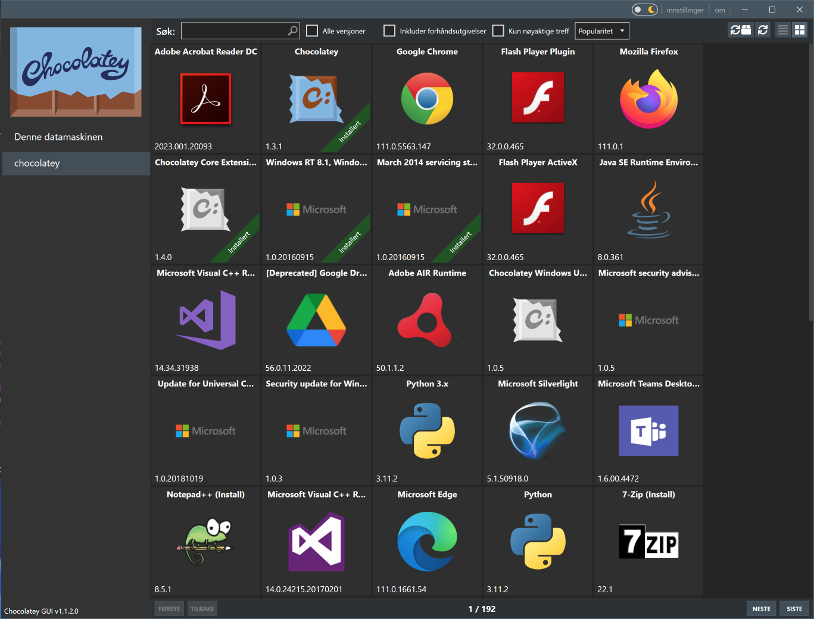

# Chocolatey

After installing [Chocolatey][1], it can be used in PowerShell or Command Prompt. There are a lot of [commands][2] available, and can be listed by running the following command:

```powershell
choco list -lo
```

| Command                                                     | Description                            |
| ----------------------------------------------------------- | -------------------------------------- |
| [list](https://chocolatey.org/docs/commands-list)           | lists remote or local packages         |
| [search](https://chocolatey.org/docs/commands-search)       | searches remote or local packages      |
| [info](https://chocolatey.org/docs/commands-info)           | retrieves package information          |
| [install](https://chocolatey.org/docs/commands-install)     | installs packages from various sources |
| [pin](https://chocolatey.org/docs/commands-pin)             | pins a package to suppress upgrades    |
| [outdated](https://chocolatey.org/docs/commands-outdated)   | retrieves packages that are outdated   |
| [upgrade](https://chocolatey.org/docs/commands-upgrade)     | upgrades packages from various sources |
| [uninstall](https://chocolatey.org/docs/commands-uninstall) | uninstalls a package                   |

## Examples

| Command                                        | Description                                           |
| ---------------------------------------------- | ----------------------------------------------------- |
| **Find a package**                             |                                                       |
| `choco list`                                   | List all chocolatey packages                          |
| `choco list --local-only`                      | List installed packages                               |
| `choco search zip`                             | Search packages mentionning "zip"                     |
| `choco search --by-tag compression`            | Search packages by their tags                         |
| `choco search --by-id-only zip`                | Search packages with "zip" in the package name        |
| `choco search --order-by-popularity zip`       | Filter and sort by package results by popularity      |
| `choco search --approved-only zip`             | Only return approved packages                         |
| `choco info 7zip`                              | Get information about 7zip package                    |
|                                                |                                                       |
| **Install**                                    |                                                       |
| `choco install 7zip`                           | Install                                               |
| `choco install 7zip --install-directory=P:\7z` | Install to a specific directory                       |
|                                                |                                                       |
| **Maintenance**                                |                                                       |
| `choco list --localonly`                       | List installed packages                               |
| `choco outdated`                               | List upgradable packages                              |
| `choco upgrade all -y`                         | Upgrade all packages                                  |
|                                                |                                                       |
| **Pinning**                                    |                                                       |
| `choco pin list`                               | List pinned packages                                  |
| `choco pin add --name 7zip`                    | Suppress upgrades for 7zip                            |
| `choco pin remove --name 7zip`                 | Supress upgrades supression for 7zip ;)               |
| **Switches**                                   | Description                                           |
| `--help`                                       | Prints out the help menu.                             |
|                                                |                                                       |
| `--install-directory=`VALUE                    | Install Directory Override                            |
|                                                |                                                       |
| `-y`, `--yes`                                  | Confirm all prompts.                                  |
| `-f`, `--force`                                | Force the behavior.                                   |
| `--what-if`                                    | Don't actually do anything, simulate.                 |
|                                                |                                                       |
| `--execution-timeout=`VALUE                    | The time to allow a command to finish.                |
| `--fail-on-standard-error`                     | Fail on standard error output (stderr).               |
| `--use-system-powershell`                      | Execute PowerShell using an external process.         |
|                                                |                                                       |
| `--debug`                                      | Show debug messaging.                                 |
| `--verbose`                                    | Show verbose messaging.                               |
| `--trace`                                      | Show trace messaging.                                 |
| `--log-file=`VALUE                             | Log File to output to in addition to regular loggers. |
|                                                |                                                       |
| `--no-color`                                   | Do not show colorization in output.                   |
| `--limit-output`                               | Limit the output to essential information.            |
| `--no-progress`                                | Do not show download progress percentages.            |
|                                                |                                                       |
| `--allow-unofficial-build`                     | Allow the use of an unofficial build.                 |

## Optional GUI

If you want to use a [GUI for Chocolatey][3], you can install the Chocolatey GUI with the following command:

```powershell
choco install chocolateygui -y
```



[1]: https://docs.chocolatey.org/en-us/choco/commands/
[2]: https://chocolatey.org/docs/commands-list
[3]: https://chocolatey.org/packages/chocolateygui
